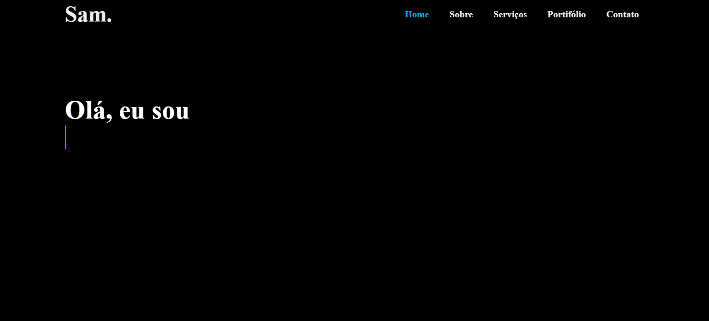

# WebSite-Portifolio
 ## Visão Geral
Esta landing page foi criada com a finalidade de comprovar meus conhecimentos de forma prática. Foi adicionado algumas funcionalidades interessantes. Tais como: 

- Navegação Intuitiva: A navegação é simplificada e permite aos visitantes acessar facilmente diferentes seções do meu portfólio.

- Texto Animado: Na seção inicial, utilizei JavaScript e CSS para criar um efeito de texto animado que adiciona um toque interativo à página.

- Botões de Chamada para Ação (CTA): Incluí botões "Contrate-me" e "Vamos conversar" que incentivam os visitantes a entrar em contato ou contratar meus serviços.

- Links para Mídias Sociais: Você pode encontrar links para minhas contas de mídia social na seção inicial, facilitando a conexão comigo em outras plataformas.

## Captura de Tela

## Tecnologias usadas
- HTML5
- CSS3
- JavaScript
- Bibliotecas externas: Boxicons e Google Fonts